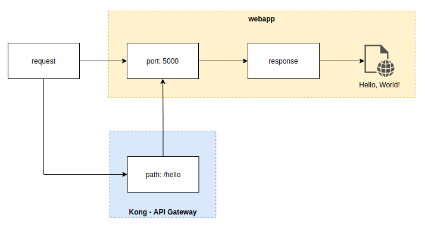
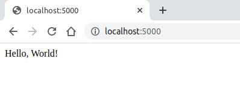
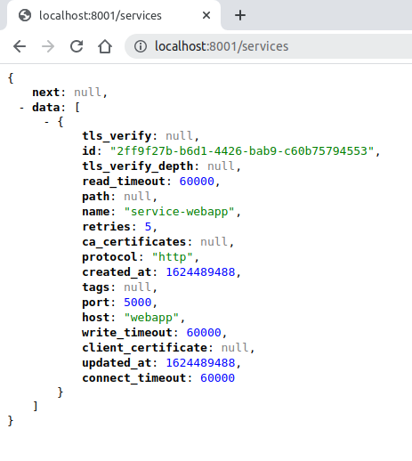
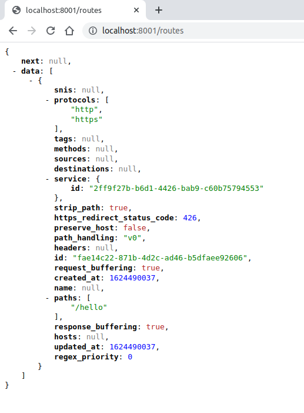
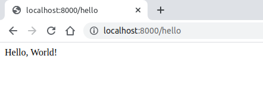

# Sumário

- [Sumário](#sumário)
- [Aplicativo Web em Python e Kong - API Gateway](#aplicativo-web-em-python-e-kong---api-gateway)
  - [Ambiente](#ambiente)
  - [Pré-requisitos](#pré-requisitos)
  - [Aplicativo Web em Python](#aplicativo-web-em-python)
    - [Estrutura de pastas](#estrutura-de-pastas)
    - [Dockerfile](#dockerfile)
  - [API Gateway](#api-gateway)
    - [Serviços](#serviços)
    - [Informações](#informações)
    - [Configurando um Serviço](#configurando-um-serviço)
      - [Adicione o serviço usando a API Admin](#adicione-o-serviço-usando-a-api-admin)
      - [Adicione uma rota para o serviço](#adicione-uma-rota-para-o-serviço)
      - [Envie as solicitações de proxy ao Kong](#envie-as-solicitações-de-proxy-ao-kong)
  - [Conclusão](#conclusão)


# Aplicativo Web em Python e Kong - API Gateway
Este projeto tem como objetivo mostrar o passo a passo para a construção e a execução de um Aplicativo Web em Python, em conjunto com o [Kong - API Gateway](https://docs.konghq.com), utilizando containers em Docker. 

Serão abordados os seguintes itens no projeto:

* Aplicativo Python
* Dockerfile com as instruções necessárias para construir uma imagem Python
* Build e execução da imagem criada como um container
* Orquestração de containers usando Compose
* Kong - API Gateway


## Ambiente

O framework web [Flask](https://pt.wikipedia.org/wiki/Flask_(framework_web)) será importado dentro do aplicativo **webapp** em Python. O **webapp** ao receber um request na porta ```5000``` retornará a mensagem: ```Hello, World```.

O **Kong - API Gateway** redirecionará as requisições enviadas ao path ```/hello``` para a porta ```5000``` do **webapp**, conforme imagem abaixo.

 |  | 
 | :--:| 
 | *Ambiente*| 

## Pré-requisitos 
Para a execução do ambiente, instale as seguintes ferramentas em seu localhost:

* [Docker](https://docs.docker.com/desktop/)
* Um IDE ou editor de texto para editar arquivos, ex.: [Visual Studio Code](https://code.visualstudio.com/Download)
* Extensão [JSONView](https://chrome.google.com/webstore/detail/jsonview/chklaanhfefbnpoihckbnefhakgolnmc?hl=pt-BR) para Google Chrome para facilitar a visualização dos serviços e rotas criadas no **Kong - API Gateway**


## Aplicativo Web em Python

### Estrutura de pastas

* Crie a seguinte estrutura de pastas em seu localhost
  ```bash
  lab/
  └── resources/
      ├── kong/
      └── webapp/
          └── files/
  ```

* Para construir o aplicativo Python - **webapp**, navegue até a pasta ```files/```

* Crie o arquivo ```app.py``` com o código, para importar o framework web [Flask](https://flask.palletsprojects.com/) para o **webapp**:

  ```python
  from flask import Flask
  app = Flask(__name__)

  @app.route('/')
  def hello():  
      return 'Hello, World!'

  if __name__ == '__main__':
      app.run(debug=True,host='0.0.0.0')
  ```

* Crie o arquivo ```requirements.txt``` e adicione ```Flask```:

  ```txt
  Flask
  ```

### Dockerfile

* Navegue até a pasta ```webapp/```

* Defina o ambiente do aplicativo em um [Dockerfile](https://docs.docker.com/engine/reference/builder/) ```webapp.dockerfile```: 

  ```dockerfile
  FROM python:3.8-slim-buster
  WORKDIR /app
  COPY ./files .
  RUN pip3 install -r requirements.txt
  CMD [ "python3", "-m" , "flask", "run", "--host=0.0.0.0"]
  ```

* Para criar a imagem do **webapp** utilizando o Dockerfile, com o nome ```webapp``` e tag ```1.0-lab``` execute no shell:
  ```docker
  $ docker build -t webapp:1.0-lab -f ./webapp.dockerfile .
  ```
  Aguarde a conclusão dos Steps e verifique se a imagem foi criada:
    ```docker
    $ docker images
    REPOSITORY                       TAG               IMAGE ID       CREATED         SIZE
    webapp                           1.0-lab           1617d5dc2884   3 minutes ago   125MB
  ```

### Container

* Para criar um container com base na imagem ```webapp 1.0-lab```, expondo a porta ```5000``` do container com a porta ```5000``` do localhost, execute:
  ```docker
  $ docker run -d -p 5000:5000 --name webapp webapp:1.0-lab
  ```

* Verifique o ```STATUS``` do container ```webapp```:
  ```docker
  $ docker ps
  CONTAINER ID   IMAGE                                         COMMAND                  CREATED          STATUS          PORTS                                                                                  NAMES
  4f26fed27417   webapp:1.0-lab                                "python3 -m flask ru…"   57 seconds ago   Up 56 seconds   0.0.0.0:5000->5000/tcp, :::5000->5000/tcp                                              webapp
  ```

* Envie uma request através do seu navegador acessando o endereço http://localhost:5000, para verificar a resposta do ```webapp```:

  |  | 
  | :--:| 
  | *Teste via navegador http://localhost:5000*| 

  Se preferir, utilize o ```curl``` no shell do localhost
  ```docker
  $ curl http://localhost:5000
  Hello, World!%  
  ```

  O teste foi executado com sucesso. O **webapp** está respondendo as requisições.![]

* Remova o container ```webapp```:

  ```docker
  $ docker rm -f webapp
  webapp
  ```


## API Gateway

### Serviços

* Para implantar o **Kong - API Gateway** e configurá-lo, navegue até a pasta ```kong/```.

* Crie um [Compose file](https://docs.docker.com/compose/compose-file/) com o nome: ```kong-compose.yml``` para definir os serviços que compõem o aplicativo **webapp** e o **Kong - API Gateway**, e executá-los juntos em um ambiente isolado. Para mais detalhes sobre o Compose file, consulte a documentação - [Kong in Docker Compose](https://github.com/Kong/docker-kong/tree/master/compose).
  
  >Nota: O ```webapp``` foi adicionado no compose file  a partir da *linha 146*. 

  ```yml
  version: '3.3'

  volumes:
    kong_data: {}
    kong_prefix_vol:
      driver_opts:
      type: tmpfs
      device: tmpfs
    kong_tmp_vol:+
      driver_opts:
      type: tmpfs
      device: tmpfs

  networks:
    kong-net:
      external: false

  services:
    kong-migrations:
      container_name: kong-migrations
      image: "${KONG_DOCKER_TAG:-kong:latest}"
      command: kong migrations bootstrap
      depends_on:
        - db
      environment:
        KONG_DATABASE: postgres
        KONG_PG_DATABASE: ${KONG_PG_DATABASE:-kong}
        KONG_PG_HOST: db
        KONG_PG_USER: ${KONG_PG_USER:-kong}
        KONG_PG_PASSWORD_FILE: /run/secrets/kong_postgres_password
      secrets:
        - kong_postgres_password
      networks:
        - kong-net
      restart: on-failure
      deploy:
        restart_policy:
          condition: on-failure

    
    kong-migrations-up:
      container_name: kong-migrations-up
      image: "${KONG_DOCKER_TAG:-kong:latest}"
      command: kong migrations up && kong migrations finish
      depends_on:
        - db
      environment:
        KONG_DATABASE: postgres
        KONG_PG_DATABASE: ${KONG_PG_DATABASE:-kong}
        KONG_PG_HOST: db
        KONG_PG_USER: ${KONG_PG_USER:-kong}
        KONG_PG_PASSWORD_FILE: /run/secrets/kong_postgres_password
      secrets:
        - kong_postgres_password
      networks:
        - kong-net
      restart: on-failure
      deploy:
        restart_policy:
          condition: on-failure

    kong:
      container_name: kong
      image: "${KONG_DOCKER_TAG:-kong:latest}"
      user: "${KONG_USER:-kong}"
      depends_on:
        - db
      environment:
        KONG_ADMIN_ACCESS_LOG: /dev/stdout
        KONG_ADMIN_ERROR_LOG: /dev/stderr
        KONG_PROXY_LISTEN: "${KONG_PROXY_LISTEN:-0.0.0.0:8000}"
        KONG_ADMIN_LISTEN: "${KONG_ADMIN_LISTEN:-0.0.0.0:8001}"
        KONG_CASSANDRA_CONTACT_POINTS: db
        KONG_DATABASE: postgres
        KONG_PG_DATABASE: ${KONG_PG_DATABASE:-kong}
        KONG_PG_HOST: db
        KONG_PG_USER: ${KONG_PG_USER:-kong}
        KONG_PROXY_ACCESS_LOG: /dev/stdout
        KONG_PROXY_ERROR_LOG: /dev/stderr
        KONG_PG_PASSWORD_FILE: /run/secrets/kong_postgres_password
        KONG_PREFIX: ${KONG_PREFIX:-/var/run/kong}
      secrets:
        - kong_postgres_password
      networks:
        - kong-net
      ports:
        # The following two environment variables default to an insecure value (0.0.0.0)
        # according to the CIS Security test.
        - "${KONG_INBOUND_PROXY_LISTEN:-0.0.0.0}:8000:8000/tcp"
        - "${KONG_INBOUND_SSL_PROXY_LISTEN:-0.0.0.0}:8443:8443/tcp"
        # Making them mandatory but undefined, like so would be backwards-breaking:
        # - "${KONG_INBOUND_PROXY_LISTEN?Missing inbound proxy host}:8000:8000/tcp"
        # - "${KONG_INBOUND_SSL_PROXY_LISTEN?Missing inbound proxy ssl host}:8443:8443/tcp"
        # Alternative is deactivating check 5.13 in the security bench, if we consider Kong's own config to be enough security here

        - "127.0.0.1:8001:8001/tcp"
        - "127.0.0.1:8444:8444/tcp"
      healthcheck:
        test: ["CMD", "kong", "health"]
        interval: 10s
        timeout: 10s
        retries: 10
      restart: on-failure:5
      read_only: true
      volumes:
        - kong_prefix_vol:${KONG_PREFIX:-/var/run/kong}
        - kong_tmp_vol:/tmp
      deploy:
        restart_policy:
          delay: 50s
          condition: on-failure
          max_attempts: 5
          window: 10s
        resources:
          limits:
            cpus: ${KONG_CPU_LIMIT:-2}
            memory: ${KONG_MEMORY_LIMIT:-2g}
      security_opt:
        - no-new-privileges

    db:
      container_name: database
      image: postgres:9.5
      environment:
        POSTGRES_DB: ${KONG_PG_DATABASE:-kong}
        POSTGRES_USER: ${KONG_PG_USER:-kong}
        POSTGRES_PASSWORD_FILE: /run/secrets/kong_postgres_password
      secrets:
        - kong_postgres_password
      healthcheck:
        test: ["CMD", "pg_isready", "-U", "${KONG_PG_USER:-kong}"]
        interval: 30s
        timeout: 30s
        retries: 3
      restart: on-failure
      deploy:
        restart_policy:
          condition: on-failure
      stdin_open: true
      tty: true
      networks:
        - kong-net
      volumes:
        - kong_data:/var/lib/postgresql/data

    webapp:
      container_name: webapp
      build: 
        context: ../webapp
        dockerfile: webapp.dockerfile
      image: webapp:1.0-lab
      ports: 
      - 5000:5000
      networks: 
      - kong-net

  secrets:
    kong_postgres_password:
      file: ./POSTGRES_PASSWORD

  ```

* Crie um arquivo ```POSTGRES_PASSWORD``` informando o ```secrets``` que será utilizado no compose file:
  ```txt
  kong
  ```
* Execute ```docker compose up```, o comando Docker compose inicia e executa todo os componentes do aplicativo **webapp** em conjunto com o **Kong - API Gateway**. 
  Para informar o local do Compose file ```kong-compose.yml```, utilize o argumento ```-f```:

  ```docker
  $ docker-compose -f kong-compose.yml up -d 
  ```

* Verifique o ```State``` dos serviços. Apenas os serviços ```database```, ```kong```, ```webapp``` devem estar ```up```
    ```docker
    $ docker-compose -f kong-compose.yml ps 
    WARNING: Some services (db, kong, kong-migrations, kong-migrations-up) use the 'deploy' key, which will be ignored. Compose does not support 'deploy' configuration - use `docker stack deploy` to deploy to a swarm.
          Name                     Command               State                                                  Ports                                               
    -----------------------------------------------------------------------------------------------------------------------------------------------------------------
    database             docker-entrypoint.sh postgres    Up       5432/tcp                                                                                          
    kong                 /docker-entrypoint.sh kong ...   Up       0.0.0.0:8000->8000/tcp, 127.0.0.1:8001->8001/tcp, 0.0.0.0:8443->8443/tcp, 127.0.0.1:8444->8444/tcp
    kong-migrations      /docker-entrypoint.sh kong ...   Exit 0                                                                                                     
    kong-migrations-up   /docker-entrypoint.sh kong ...   Exit 0                                                                                                     
    webapp               python3 -m flask run --hos ...   Up       0.0.0.0:5000->5000/tcp,:::5000->5000/tcp        
    ```

* Envie uma request através do seu navegador acessando o endereço http://localhost:5000, para verificar a resposta do ```webapp```:

  |  | 
  | :--:| 
  | *Teste via navegador http://localhost:5000*| 

  Se preferir, utilize o ```curl``` no shell do localhost
  ```docker
  $ curl http://localhost:5000
  Hello, World!%  
  ```

  O teste foi executado com sucesso. O **webapp** está respondendo as requisições.

### Informações

Por padrão, Kong possui as seguintes portas como *listens*:

* ```:8000``` no qual Kong escuta o tráfego HTTP de entrada de seus clientes e o encaminha para seus serviços upstream.
* ```:8443``` no qual Kong escuta o tráfego HTTPS de entrada. Essa porta tem um comportamento semelhante à :8000porta, exceto que espera apenas tráfego HTTPS. Esta porta pode ser desabilitada por meio do arquivo de configuração.
* ```:8001``` no qual a [API de administração](https://docs.konghq.com/2.3.x/admin-api) usada para configurar escuta do Kong.
* ```:8444``` na qual a API Admin escuta o tráfego HTTPS.

Agora que o **Kong** está em execução, você pode interagir com a API Admin. Para começar, vá para Configurando um Serviço.
 *   Para adicionar uma API ao Kong, primeiro é necessário adicionar um ```service```; esse é o nome que Kong usa para se referir às APIs upstream e microsserviços que gerencia.
  
 *  Antes de enviar solicitações ao Serviço, é necessário adicionar uma ```Route``` a ele. As rotas especificam como (e se) as solicitações são enviadas aos seus Serviços depois que chegam a Kong. Um único serviço pode ter várias rotas.

 * Depois de configurar o Serviço e a Rota, será possível enviar requisições através do **Kong**, redirecionando para o **webapp**.

### Configurando um Serviço

#### Adicione o serviço usando a API Admin
* Envie a seguinte solicitação ```cURL``` para adicionar o serviço ```service-app``` (apontando para o [webapp](http://webapp:5000) na porta ```5000```) para Kong:

  ```
  $ curl -i -X POST \
    --url http://localhost:8001/services/ \
    --data 'name=service-webapp' \
    --data 'url=http://webapp:5000'
  ``` 
  A resposta será semelhante a:

  ```
  "HTTP/1.1 201 Created
  Content-Type":"application/json; charset=utf-8
  Connection":"keep-alive

    {
    "id":"2ff9f27b-b6d1-4426-bab9-c60b75794553",
    "read_timeout":60000,
    "name":"service-webapp",
    "retries":5,
    "protocol":"http",
    "created_at":1624489488,
    "port":5000,
    "host":"webapp",
    "write_timeout":60000,
    "updated_at":1624489488,
    "connect_timeout":60000
  }
  ```  
* Para visualizar os dados do serviço em seu navegador, acesse http://localhost:8001/services
   
  |  | 
  | :--:| 
  | *Teste via navegador http://localhost:8001/services*| 

#### Adicione uma rota para o serviço

* Envie a seguinte solicitação ```cURL``` para adicionar uma rota para o serviço ```service-app```, informando o path ```\hello```

  ``` 
  $ curl -i -X POST \
    --url http://localhost:8001/services/service-webapp/routes \
    --data 'paths[]=/hello'
  ``` 
  A resposta será semelhante a:

  ```
  "HTTP/1.1 201 Created
  Content-Type":"application/json; charset=utf-8
  Connection":"keep-alive
  {
    "snis":null,
    "protocols":[
        "http",
        "https"
    ],
    "methods":null,
    "service":{
        "id":"2ff9f27b-b6d1-4426-bab9-c60b75794553"
    },
    "strip_path":true,
    "path_handling":"v0",
    "id":"fae14c22-871b-4d2c-ad46-b5dfaee92606",
    "request_buffering":true,
    "created_at":1624490037,
    "name":null,
    "paths":[
        "/hello"
    ]
  }
  ```

* Para visualizar os dados da rota em seu navegador, acesse http://localhost:8001/routes
   
  |  | 
  | :--:| 
  | *Teste via navegador http://localhost:8001/routes*| 

O Kong agora está pronto para receber as solicitações de proxy.

Para mais detalhes, consulte [Admin API](https://docs.konghq.com/gateway-oss/2.3.x/admin-api/)

#### Envie as solicitações de proxy ao Kong

* Envie a seguinte solicitação ```cURL``` para verificar se Kong está encaminhando as solicitações para o **webapp**. Observe que, por padrão, o Kong lida com solicitações de proxy na porta ```:8000```:

  Envie uma request através do seu navegador acessando o endereço http://localhost:8000/hello:

  |  | 
  | :--:| 
  | *Teste via navegador http://localhost:8000/hello*| 

  Se preferir, utilize o ```curl``` no shell do localhost
  ```docker
  $ curl http://localhost:8000/hello
  Hello, World!%  
  ```

  O teste foi executado com sucesso. O **Kong - API Gateway** está redirecionando as requisições enviadas à ```http://localhost:8000/hello``` para o **webapp** em ```http://localhost:5000```.

## Conclusão
Neste projeto foi possível ver de forma simples o funcionamento de um Aplicativo Web em Python recebendo as requisições e retornando um "Hello World", e também um API Gateway redirecionando as requisições para o aplicativo Web. 

Todo o ambiente foi implantando utilizando containers em Docker, o que mostra a versatilidade em trabalhar em containers!

